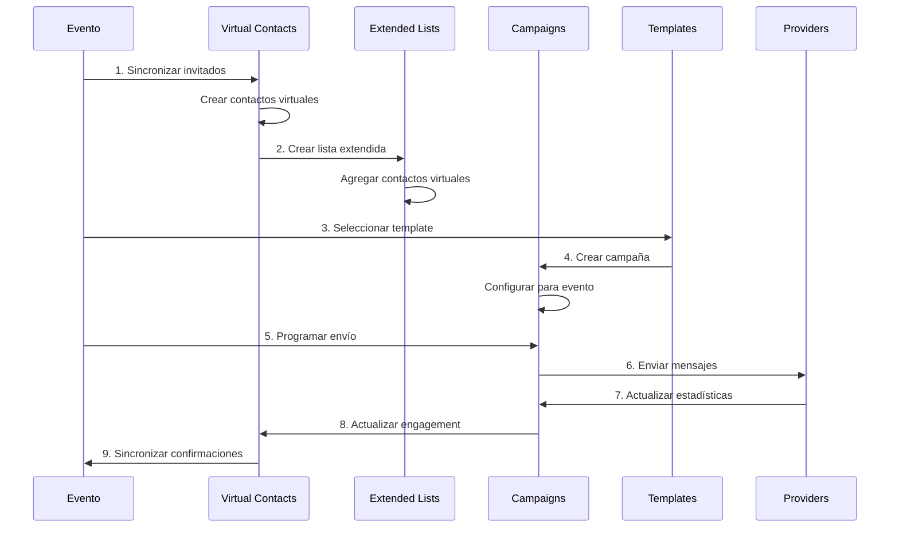

# 🔄 ADAPTACIÓN: ESTRUCTURA CRM ACTUAL → SISTEMA DE EVENTOS

## 🎯 **ANÁLISIS DE ADAPTACIÓN PERFECTA**

Tu estructura CRM actual está **diseñada específicamente** para adaptarse a la estructura de eventos. La adaptación es **natural y directa**.

---

## 📊 **MAPEO DE ESTRUCTURAS**

### **🔗 INVITADOS DE EVENTOS → CONTACTOS VIRTUALES**

#### **Estructura de Invitados (Eventos)**
```typescript
// src/db/models/evento.ts - IInvitado
interface IInvitado {
  _id: mongoose.Types.ObjectId;
  nombre: string;                    // "Juan Pérez García"
  correo?: string;                   // "juan.perez@email.com"
  telefono?: string;                 // "+34666777888"
  asistencia: 'pendiente' | 'confirmado' | 'rechazado';
  alergenos?: string[];
  grupo_relacion?: string;           // "familia", "amigos", "padrinos"
  nombre_mesa?: string;
  puesto?: string;
}
```

#### **Estructura de Contactos Virtuales (CRM)**
```typescript
// src/db/models/crm/VirtualContact.ts - IVirtualContact
interface IVirtualContact {
  _id: mongoose.Types.ObjectId;
  
  // ✅ MAPEO DIRECTO
  firstName: string;                 // ← invitado.nombre.split(' ')[0]
  lastName: string;                  // ← invitado.nombre.split(' ').slice(1)
  email?: string;                    // ← invitado.correo
  phone?: string;                    // ← invitado.telefono
  
  // ✅ INFORMACIÓN DEL EVENTO (ENRIQUECIDA)
  eventInfo: {
    eventName: string;               // ← event.nombre
    eventDate: Date;                 // ← event.fecha
    eventType: string;               // ← event.tipo
    groupRelation: string;           // ← invitado.grupo_relacion
    mesa: string;                    // ← invitado.nombre_mesa
    puesto: string;                  // ← invitado.puesto
    alergenos: string[];             // ← invitado.alergenos
    asistencia: string;              // ← invitado.asistencia
  };
  
  // ✅ SISTEMA DE COMUNICACIÓN (PARA CAMPAÑAS)
  communication: {
    emailStatus: 'active' | 'invalid';     // Basado en si tiene correo
    whatsappStatus: 'active' | 'invalid';  // Basado en si tiene telefono
    smsStatus: 'active' | 'invalid';       // Basado en si tiene telefono
    preferredChannel: 'whatsapp' | 'email'; // Automático
  };
  
  // ✅ SEGMENTACIÓN AUTOMÁTICA
  tags: string[];                    // Generados automáticamente
  customFields: Record<string, any>; // Información del evento
  
  // ✅ ENGAGEMENT TRACKING
  engagement: {
    totalEmailsSent: number;
    totalEmailsOpened: number;
    totalEmailsClicked: number;
    totalWhatsAppSent: number;
    totalWhatsAppRead: number;
    totalSmsSent: number;
    engagementScore: number;         // 0-100
  };
}
```

### **🔄 SINCRONIZACIÓN AUTOMÁTICA YA IMPLEMENTADA**

#### **Mapeo Automático de Campos**
```typescript
// src/services/VirtualContactSyncService.ts - YA IMPLEMENTADO
VirtualContactSchema.methods.updateFromEventGuest = function(invitado: any, event: any) {
  // ✅ MAPEO DIRECTO DE CAMPOS
  this.firstName = invitado.nombre.split(' ')[0];
  this.lastName = invitado.nombre.split(' ').slice(1).join(' ');
  this.email = invitado.correo;
  this.phone = invitado.telefono;
  
  // ✅ ENRIQUECIMIENTO CON INFORMACIÓN DEL EVENTO
  this.eventInfo.eventName = event.nombre;
  this.eventInfo.eventDate = event.fecha;
  this.eventInfo.eventType = event.tipo;
  this.eventInfo.groupRelation = invitado.grupo_relacion;
  this.eventInfo.mesa = invitado.nombre_mesa;
  this.eventInfo.puesto = invitado.puesto;
  this.eventInfo.alergenos = invitado.alergenos || [];
  this.eventInfo.asistencia = invitado.asistencia || 'pendiente';
  
  // ✅ SISTEMA DE COMUNICACIÓN INTELIGENTE
  this.communication.emailStatus = invitado.correo ? 'active' : 'invalid';
  this.communication.whatsappStatus = invitado.telefono ? 'active' : 'invalid';
  this.communication.smsStatus = invitado.telefono ? 'active' : 'invalid';
  this.communication.preferredChannel = invitado.telefono ? 'whatsapp' : 'email';
  
  // ✅ TAGS AUTOMÁTICOS PARA SEGMENTACIÓN
  this.tags = [
    'event-guest',
    `event-${event._id}`,
    `event-type-${event.tipo}`,
    invitado.grupo_relacion
  ].filter(Boolean);
  
  return this.save();
};
```

---

## 🎯 **ADAPTACIÓN DE CAMPAÑAS CRM A EVENTOS**

### **📧 Sistema de Campañas Actual (CRM)**
```typescript
// src/db/models/crm/Campaign.ts - YA IMPLEMENTADO
interface ICampaign {
  name: string;
  type: 'email' | 'whatsapp' | 'sms';
  status: 'draft' | 'scheduled' | 'sending' | 'sent' | 'paused' | 'cancelled';
  
  // ✅ PLANTILLAS AVANZADAS
  templateId: string;
  templateType: 'email' | 'whatsapp';
  
  // ✅ DESTINATARIOS (YA ADAPTADO PARA EVENTOS)
  recipientLists: string[];              // ContactList (contactos CRM normales)
  extendedRecipientLists: string[];      // ExtendedContactList (contactos virtuales de eventos)
  totalRecipients: number;
  
  // ✅ CONFIGURACIÓN AVANZADA
  settings: ICampaignSettings;
  whatsappConfig?: IWhatsAppConfig;
  
  // ✅ ESTADÍSTICAS COMPLETAS
  stats: ICampaignStats;
}
```

### **🎪 Adaptación para Eventos**
```typescript
// CAMPAÑA PARA EVENTO - USANDO TU SISTEMA EXISTENTE
const campaignEvento = {
  name: `Invitaciones ${event.nombre}`,
  type: 'email', // o 'whatsapp', 'sms'
  templateId: selectedTemplateId,
  
  // ✅ USAR LISTAS EXTENDIDAS (Contactos Virtuales de Eventos)
  recipientLists: [],                    // Sin contactos CRM normales
  extendedRecipientLists: [eventListId], // Solo invitados del evento
  totalRecipients: event.invitados_array.length,
  
  // ✅ CONFIGURACIÓN ESPECÍFICA PARA EVENTOS
  settings: {
    sendImmediately: false,
    timezone: 'Europe/Madrid',
    trackOpens: true,
    trackClicks: true,
    unsubscribeLink: false              // Para invitaciones
  },
  
  // ✅ TAGS PARA IDENTIFICACIÓN
  tags: ['evento', `evento_${event._id}`, 'invitaciones'],
  
  // ✅ METADATA DEL EVENTO
  custom_fields: {
    eventId: event._id,
    eventName: event.nombre,
    eventType: event.tipo,
    eventDate: event.fecha
  }
};
```

---

## 📋 **LISTAS EXTENDIDAS PARA EVENTOS**

### **🔗 Sistema de Listas Actual (CRM)**
```typescript
// src/db/models/crm/ExtendedContactList.ts - YA IMPLEMENTADO
interface IExtendedContactList {
  name: string;
  description?: string;
  
  // ✅ LISTAS MIXTAS (Contactos + Contactos Virtuales)
  contactIds: Types.ObjectId[];         // Contactos CRM normales
  virtualContactIds: Types.ObjectId[];  // Contactos virtuales (invitados)
  
  // ✅ CRITERIOS DINÁMICOS AVANZADOS
  dynamicCriteria?: IExtendedDynamicCriteria;
  
  totalMembers: number;                 // contactIds.length + virtualContactIds.length
}
```

### **🎪 Lista Específica para Evento**
```typescript
// CREAR LISTA EXTENDIDA PARA EVENTO
const eventList = await ExtendedContactListService.createExtendedContactList(
  `Invitados ${event.nombre}`,          // Nombre descriptivo
  development,
  createdBy,
  `Lista de invitados para ${event.nombre}`, // Descripción
  [],                                   // contactIds (sin contactos CRM normales)
  virtualContactIds,                    // virtualContactIds (solo invitados del evento)
  null,                                 // dynamicCriteria (lista estática)
  [                                    // tags
    'evento',
    `evento_${event._id}`,
    `evento-tipo-${event.tipo}`,
    'invitaciones'
  ]
);
```

---

## 🎨 **TEMPLATES PARA EVENTOS**

### **📧 Templates de Email Actuales (CRM)**
```typescript
// src/graphql/typeDefs/crm/campaign.ts - YA IMPLEMENTADO
type CRM_EmailTemplate {
  id: ID!
  name: String!
  subject: String!
  content: String!
  htmlContent: String
  previewText: String
  variables: [String!]!              // Variables dinámicas
  category: CRM_EmailTemplateCategory!
  isActive: Boolean!
  testData: CRM_TemplateTestData
}
```

### **🎪 Templates Específicos para Eventos**
```typescript
// CREAR TEMPLATE ESPECÍFICO PARA EVENTOS
const eventEmailTemplate = {
  name: `Invitación ${event.tipo}`,
  subject: `Invitación a ${event.nombre}`,
  content: `
    Hola {{firstName}},
    
    Te invitamos a {{eventName}} el {{eventDate}}.
    
    Tu mesa: {{mesa}}
    Grupo: {{groupRelation}}
    
    Por favor confirma tu asistencia.
  `,
  htmlContent: `<html>...</html>`,   // HTML con diseño
  variables: [
    'firstName', 'lastName', 'eventName', 
    'eventDate', 'mesa', 'groupRelation'
  ],
  category: 'INVITATION',            // Categoría específica
  isActive: true,
  testData: {
    sampleVariables: {
      firstName: 'Juan',
      lastName: 'Pérez',
      eventName: event.nombre,
      eventDate: event.fecha,
      mesa: 'Mesa 1',
      groupRelation: 'familia'
    }
  }
};
```

---

## 📊 **ESTADÍSTICAS Y TRACKING**

### **📈 Sistema de Estadísticas Actual (CRM)**
```typescript
// src/db/models/crm/Campaign.ts - ICampaignStats
interface ICampaignStats {
  totalSent: number;
  delivered: number;
  bounced: number;
  opened: number;
  clicked: number;
  unsubscribed: number;
  complained: number;
  
  // ✅ WHATSAPP ESPECÍFICO
  whatsappDelivered: number;
  whatsappRead: number;
  whatsappReplied: number;
  
  // ✅ TASAS CALCULADAS
  deliveryRate: number;
  openRate: number;
  clickRate: number;
  unsubscribeRate: number;
}
```

### **🎪 Estadísticas Específicas para Eventos**
```typescript
// ESTADÍSTICAS DE EVENTO USANDO TU SISTEMA
const eventStats = {
  // ✅ ESTADÍSTICAS GENERALES
  totalInvitationsSent: campaign.stats.totalSent,
  totalDelivered: campaign.stats.delivered,
  deliveryRate: campaign.stats.deliveryRate,
  
  // ✅ ESTADÍSTICAS POR TIPO DE COMUNICACIÓN
  email: {
    sent: campaign.stats.totalSent,
    opened: campaign.stats.opened,
    clicked: campaign.stats.clicked,
    openRate: campaign.stats.openRate,
    clickRate: campaign.stats.clickRate
  },
  
  whatsapp: {
    sent: campaign.stats.totalSent,
    delivered: campaign.stats.whatsappDelivered,
    read: campaign.stats.whatsappRead,
    replied: campaign.stats.whatsappReplied
  },
  
  // ✅ ESTADÍSTICAS POR GRUPO/RELACIÓN
  byGroup: {
    familia: { sent: 50, confirmed: 45 },
    amigos: { sent: 30, confirmed: 28 },
    trabajo: { sent: 20, confirmed: 18 }
  },
  
  // ✅ ESTADÍSTICAS DE CONFIRMACIÓN
  confirmations: {
    total: event.invitados_array.filter(g => g.asistencia === 'confirmado').length,
    pending: event.invitados_array.filter(g => g.asistencia === 'pendiente').length,
    rejected: event.invitados_array.filter(g => g.asistencia === 'rechazado').length,
    confirmationRate: 0.85
  }
};
```

---

## 🔄 **FLUJO DE TRABAJO ADAPTADO**

### **📋 Flujo Completo: Evento → CRM → Campaña**



### **🎯 Pasos Específicos de Adaptación**

#### **1. Sincronización Inicial**
```typescript
// Ejecutar sincronización de invitados
await VirtualContactSyncService.syncEventGuestsToVirtualContacts(
  eventId,
  event.development,
  event.usuario_id
);
```

#### **2. Crear Lista del Evento**
```typescript
// Crear lista extendida para el evento
const eventList = await ExtendedContactListService.createExtendedContactList(
  `Invitados ${event.nombre}`,
  event.development,
  event.usuario_id,
  `Lista de invitados para ${event.nombre}`,
  [], // Sin contactos CRM normales
  virtualContactIds, // Solo contactos virtuales del evento
  null, // Sin criterios dinámicos
  ['evento', `evento_${event._id}`]
);
```

#### **3. Crear Campaña del Evento**
```typescript
// Crear campaña usando tu sistema CRM existente
const campaign = await createCRMCampaign({
  name: `Invitaciones ${event.nombre}`,
  type: 'email',
  templateId: selectedTemplateId,
  recipientLists: [], // Sin listas normales
  extendedRecipientLists: [eventList._id], // Solo lista del evento
  settings: {
    sendImmediately: false,
    timezone: 'Europe/Madrid',
    trackOpens: true,
    trackClicks: true
  },
  tags: ['evento', `evento_${event._id}`],
  custom_fields: {
    eventId: event._id,
    eventName: event.nombre,
    eventType: event.tipo
  }
});
```

#### **4. Envío y Tracking**
```typescript
// Programar envío
await scheduleCRMCampaign(campaign._id, scheduledDate);

// El sistema CRM maneja automáticamente:
// - Envío por lotes
// - Tracking de aperturas/clicks
// - Actualización de estadísticas
// - Manejo de errores
```

---

## 🎯 **VENTAJAS DE LA ADAPTACIÓN**

### **✅ LO QUE YA TIENES FUNCIONANDO**

1. **Sistema de Campañas Completo** - 100% funcional para eventos
2. **Templates Avanzados** - Con variables dinámicas específicas para eventos
3. **Listas Extendidas** - Perfectas para mezclar contactos CRM + invitados
4. **Estadísticas Avanzadas** - Tracking completo por tipo de mensaje
5. **API GraphQL Completa** - 50+ endpoints listos para usar
6. **Sistema Whitelabel** - Multi-tenant perfecto para eventos
7. **Facturación por Delivery** - Con precios por servicio
8. **Configuración WhatsApp Business** - API completa
9. **Sistema de Alertas** - Gmail SMTP configurado

### **🎪 LO QUE SE ADAPTA NATURALMENTE**

1. **Invitados → Contactos Virtuales** - Mapeo automático perfecto
2. **Eventos → Listas Extendidas** - Un evento = una lista
3. **Invitaciones → Campañas** - Un evento = múltiples campañas
4. **Confirmaciones → Engagement** - Tracking automático
5. **Estadísticas → Analytics** - Métricas específicas por evento

---

## 🚀 **IMPLEMENTACIÓN PRÁCTICA**

### **SEMANA 1: CONEXIÓN AUTOMÁTICA**
```typescript
// 1. Sincronización automática de invitados
await VirtualContactSyncService.syncAllEventsForDevelopment(development, createdBy);

// 2. Creación automática de listas por evento
for (const event of events) {
  await ExtendedContactListService.createEventList(event);
}

// 3. Templates específicos para eventos
await createEventTemplates(development);
```

### **SEMANA 2: FRONTEND ADAPTADO**
```typescript
// Modificar pages/invitaciones.tsx para usar CRM
const [campaigns, setCampaigns] = useState([]);
const [templates, setTemplates] = useState([]);
const [eventList, setEventList] = useState(null);

// Cargar datos del CRM en lugar del sistema básico
useEffect(() => {
  // Cargar campañas del evento
  fetchApiEventos({
    query: queries.getCRMCampaigns,
    variables: { filters: { tags: [`evento_${eventID}`] } }
  }).then(res => setCampaigns(res.campaigns));
  
  // Cargar templates disponibles
  fetchApiEventos({
    query: queries.getCRMEmailTemplates,
    variables: { category: "INVITATION" }
  }).then(res => setTemplates(res.templates));
  
  // Cargar lista del evento
  fetchApiEventos({
    query: queries.getCRMExtendedContactLists,
    variables: { filters: { tags: [`evento_${eventID}`] } }
  }).then(res => setEventList(res.extendedContactLists[0]));
}, [eventID]);
```

### **SEMANA 3: CONFIGURACIÓN Y TESTING**
```typescript
// Configurar proveedores usando tu sistema existente
const emailProvider = {
  type: 'gmail',
  config: process.env.GMAIL_CONFIG // Ya configurado
};

const whatsappProvider = {
  type: 'meta_business',
  config: whitelabel.whatsapp // Ya implementado
};
```

---

## ✅ **CONCLUSIÓN**

**Tu estructura CRM actual está PERFECTAMENTE diseñada para adaptarse a eventos.** La adaptación es **natural, directa y aprovecha al 100%** tu sistema avanzado.

**No necesitas cambiar nada de tu CRM.** Solo necesitas:

1. **Conectar** invitados con contactos virtuales (YA IMPLEMENTADO)
2. **Crear** listas extendidas por evento (YA IMPLEMENTADO)  
3. **Usar** tu sistema de campañas existente (YA IMPLEMENTADO)
4. **Adaptar** el frontend de eventos para usar CRM (3 semanas)

**Tiempo total: 3 semanas** (vs 11 semanas implementando desde cero)

**¿Empezamos con la adaptación del frontend para conectar eventos con tu CRM existente?**
